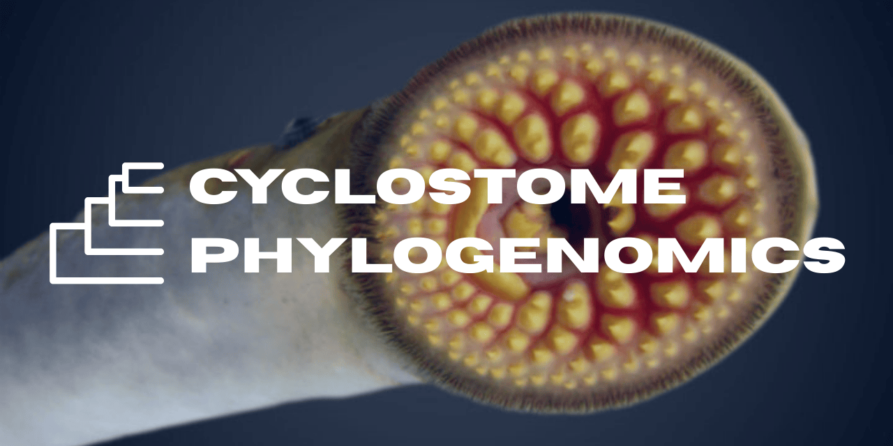

# Cyclostome Phylogenomics
This repository contains scripts and supplementary information used for the following: 

## SICB 2026 Poster: [Time calibrated phylogenomic analysis of cyclostome divergence, diversity and biogeography](SICB_Poster/Christensen-Fudge-Plachetzki-SICB2026-poster.pdf)
Evan James Christensen*1, Douglas S. Fudge2, David C. Plachetzki1\
*Presenter	1Department of Molecular, Cellular, and Biomedical Sciences, University of New Hampshire, Durham, NH, USA	2Schmid College of Science and Technology, Chapman University, Orange, CA, USA
### <ins>Abstract</ins>
The superclass Cyclostomata—hagfishes and lampreys—represents the only surviving lineage of jawless vertebrates (agnathans), offering a unique window into early vertebrate diversification. Once regarded as paraphyletic, cyclostomes are now supported as a monophyletic clade by molecular evidence. Yet, despite their evolutionary significance, a comprehensive phylogenomic analysis of the group has been lacking. Here, we present a comprehensive time-calibrated phylogeny of cyclostomes, using mitochondrial markers from 113 species, with additional genome and transcriptome data from 30 of those species, encompassing all publicly available phylogenetic markers for cyclostomes. Our analyses provide robust support for cyclostome monophyly and date the hagfish–lamprey split to the early Paleozoic. Although this divergence between hagfish and lamprey is ancient, diversification within both lineages is comparatively recent, beginning in the Mesozoic. By integrating mitochondrial and genomic data, we resolve several interspecific and intergeneric relationships and establish a comparative phylogenetic framework that spans all sequenced cyclostome species. We leverage this framework to investigate the biogeographic correlates of cyclostome diversity.
